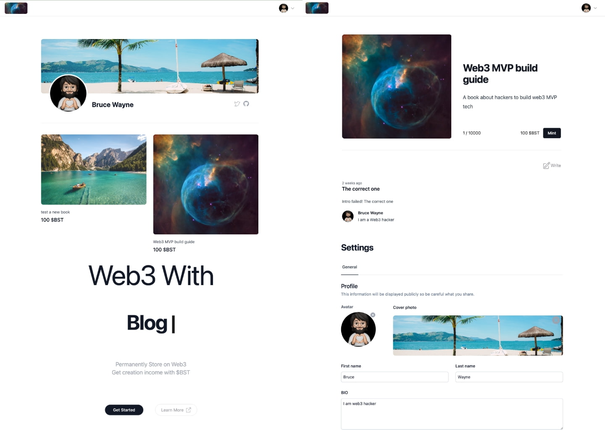

## Web3 Blog Platform with NFT-Gating as Payment for Subscribers

An open-source version of Mirror and Medium compose

<h2 align="center">
Web3 Blog Platform for Web3
</h2> 

<pre align="center">
🧪 Working in Progress
</pre>

 
<a href="https://web3nft.social/">Online Preview</a>
 
<a href="https://www.loom.com/share/36a56fdd3efb4da9af8153d5a5309e76">Video Demo</a>
  

## Features

- Web3 Native: All data on Blockchain and IPFS
- Web2 UX: With cache in serverless backend provides a much better experience than Frontend only DApp
- NFT-Gating: Creator's creation gating by NFT
- CreatorFi: creator can get invest by selling limited project-level NFT.
- Reader-friendly: User can pay by mint NFT as a one-time-payment for the creator
## Tech

- [💚 Nuxt 3](https://nuxt.com/) - SSR, ESR, File-based routing, components auto importing, modules, etc.

- ⚡️ Vite - Instant HMR.

- 🎨 [UnoCSS](https://github.com/antfu/unocss) - The instant on-demand atomic CSS engine.

- 😃 Use icons from any icon sets in Pure CSS, powered by [UnoCSS](https://github.com/antfu/unocss).

- 🔥 The `<script setup>` syntax.

- 🍍 [State Management via Pinia](https://pinia.esm.dev), see [./composables/user.ts](./composables/user.ts).

- 📑 [Layout system](./layouts).

- 📥 APIs auto importing - for Composition API, VueUse and custom composables.

- 🏎 Zero-config cloud functions and deploy.

- 🦾 TypeScript, of course.

- 📲 [PWA](https://github.com/vite-pwa/nuxt) with offline support and auto update behavior.

## Plugins

### Nuxt Modules

- [VueUse](https://github.com/vueuse/vueuse) - collection of useful composition APIs.
- [ColorMode](https://github.com/nuxt-community/color-mode-module) - dark and Light mode with auto detection made easy with Nuxt.
- [UnoCSS](https://github.com/antfu/unocss) - the instant on-demand atomic CSS engine.
- [Pinia](https://pinia.esm.dev/) - intuitive, type safe, light and flexible Store for Vue.
- [VitePWA](https://github.com/vite-pwa/nuxt) - zero-config PWA Plugin for Nuxt 3.

## IDE

We recommend using [VS Code](https://code.visualstudio.com/) with [Volar](https://github.com/johnsoncodehk/volar) to get the best experience (You might want to disable Vetur if you have it).
